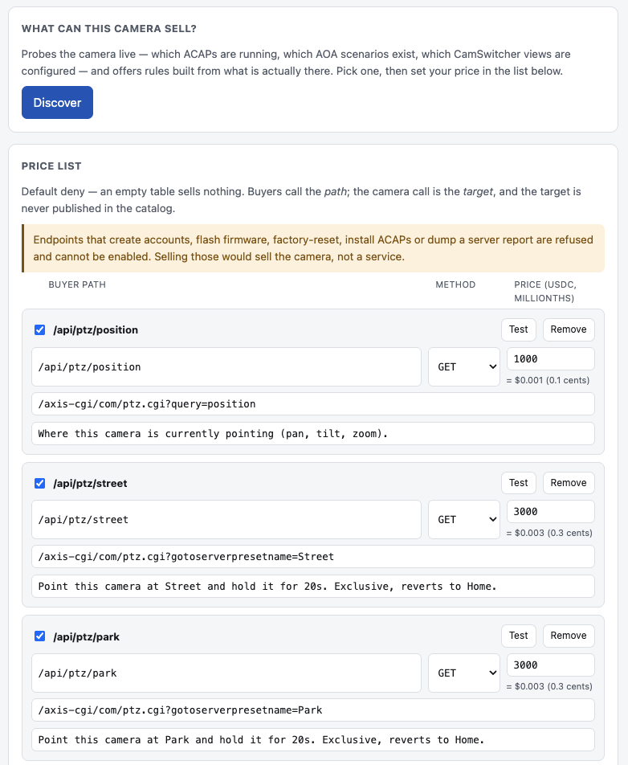
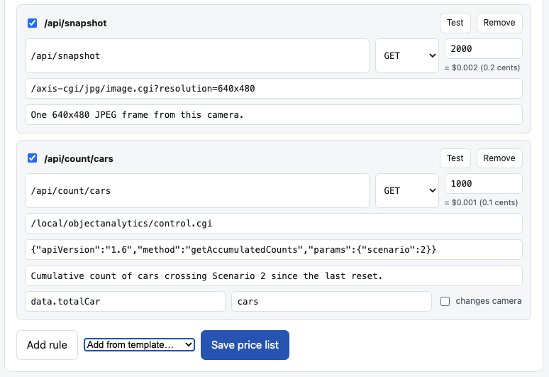
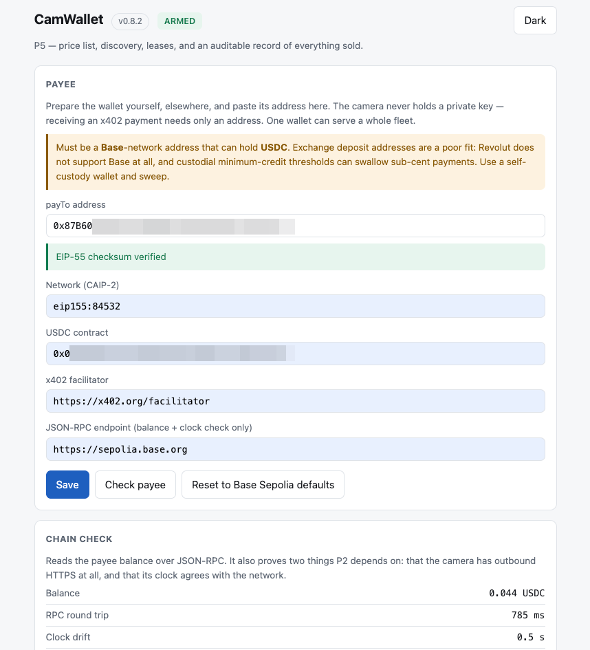
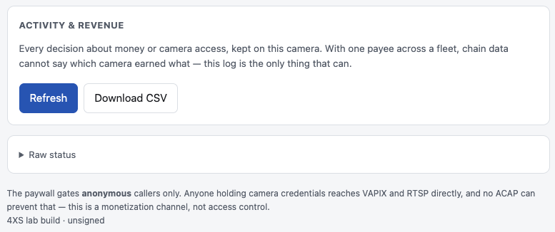

# CamWallet — sell answers, not video

**An AXIS camera that charges for what it knows.** CamWallet is an ACAP that turns an enrolled AXIS
camera into an [x402](https://x402.org) seller: an agent asks a question, pays a fraction of a cent in
USDC, and gets back one narrow, privacy-minimized, audited answer. No account. No API key. No stream.

> ## ⚠️ PROOF OF CONCEPT · WORKING PROTOTYPE
>
> **Everything described here runs — on one AXIS Q1656, against the Base Sepolia testnet.** That is the
> claim, and it is the whole claim. This is a lab build: **unsigned**, **testnet only**, **one camera**,
> no production deployment, no pilot customer, no mainnet money. It exists to answer *"can an AXIS camera
> be an x402 seller?"* — not to be bought, installed on a fleet, or exposed to the internet.
>
> The source is not published yet. See [Status](#status) for what is verified on hardware and what isn't.

**[→ Read the one-pager](https://kotyzap.github.io/Sell-answers-not-video---x402-for-Axis/)** · [日本語](https://kotyzap.github.io/Sell-answers-not-video---x402-for-Axis/ja/) · [Čeština](https://kotyzap.github.io/Sell-answers-not-video---x402-for-Axis/cs/)

---

## The whole thing in five lines

```http
GET /local/camwallet/api/snapshot

→ 402 Payment Required        accepts: USDC, base-sepolia, exact
→ retry with PAYMENT-SIGNATURE   (EIP-3009 authorization, signed by the buyer)
→ 200 image/jpeg + PAYMENT-RESPONSE   tx 0x54362605…14e7b03f
```

A stranger's wallet bought a 44 KB JPEG from a camera for 0.002 USDC. Nobody was introduced, no contract
was signed, and the camera holds no private key.

## Why answers, not video

A software agent that needs to know whether the loading bay is clear does not want an RTSP stream. It
wants a sentence. Selling the stream means handing over everything the camera can see, forever, to
whoever holds the credentials — and then arguing about what they did with it.

CamWallet sells the **answer**: one configured question, one price, one audit line.

```
GET /api/count/cars   →   {"value": 12, "unit": "cars", "at": "2026-09-01T22:14:03Z"}
```

The buyer paid for cars. AXIS Object Analytics also knows how many *people* walked past. They don't get
that — the rule extracts one field, and field extraction is a privacy control, not a formatting nicety.

## What the owner controls

Everything, from one settings page on the camera:

| | |
|---|---|
| **Price list** | Owner picks which VAPIX calls and which other ACAPs' endpoints are for sale, and what each costs. Default deny: an empty table sells nothing. |
| **Buyer path ≠ camera target** | Buyers call `/api/snapshot`; the camera call behind it is never published. The price list is not a map of the camera's attack surface. |
| **Leases** | Some things are rivalrous. A PTZ preset or a view switch is sold as an exclusive time lease — one buyer at a time, hard maximum, per-payer cooldown, and an automatic revert when time runs out. |
| **Kill switch** | One click disarms, ends any lease in progress and puts the camera back. |
| **Audit log** | Every decision about money or camera access, on the camera, exportable as CSV. |

## What the owner sees

<p align="center">
  
  
</p>

*Left:* discovery probes the camera live — which ACAPs run, which AOA scenarios exist, which PTZ presets
are configured — and offers rules built from what is actually there. *Right:* a rule that sells
`data.totalCar` out of an AOA payload, priced at 0.001 USDC.

<p align="center">
  
  
</p>

*Left:* the payee is an address the owner pastes in — **the camera never holds a private key**, because
receiving x402 needs only an address. A stolen camera leaks no funds. *Right:* with one payee across a
fleet, an EIP-3009 transfer carries no memo, so on-chain data cannot say which camera earned what. This
log is the only per-camera revenue record that exists.

## How it works

| | |
|---|---|
| **1 · Request** | An agent hits a path the owner published in the free catalog. Exact match, no globs. |
| **2 · Challenge** | The ACAP answers `402` with a standard x402 body: price, asset, chain, payee. |
| **3 · Authorize** | The agent retries with a signed `PAYMENT-SIGNATURE` header. A third-party facilitator verifies it; no money has moved. |
| **4 · Produce** | Only now does the camera do the work. Rate limits, lease exclusivity and cooldowns are all checked before this point. |
| **5 · Capture** | Settlement happens **last**, with the goods in hand. If the camera fails, nobody is charged. |

`authorize → produce → capture`, in that order, on purpose: the alternative is charging for something you
then fail to deliver.

## Guardrails

- **No key on the camera.** The payee address is supplied by the admin; the device signs nothing.
- **A denylist that isn't overridable.** Creating accounts, flashing firmware, factory reset, reboot,
  installing ACAPs, server reports, writing configuration — refused, checked when a rule is saved *and*
  every time it is used. Selling those would sell the camera, not a service.
- **Fail closed.** Facilitator unreachable → `402`. No payee, or a clock that disagrees with the
  network → refuses to arm.
- **A payment is never charged twice**, and a replayed payment never produces a fresh answer.
- **Maximally standard.** x402 v2, `exact` scheme, EIP-3009, USDC on Base. If a generic x402 client needs
  to special-case the camera, that's a bug.

## What this is *not*

**It is not access control.** An ACAP cannot firewall its own camera. Anyone holding camera credentials
reaches VAPIX and RTSP directly, and CamWallet is invisible to them. What it gates is *anonymous* callers.
It is a monetization channel — say that, never "access control".

It is also not: a video analytics product, a way to expose a camera safely to the internet (the Axis
Device ID certificate is not publicly trusted), a custody solution (the money is the operator's, settled
operator-to-operator), or a legal-evidence claim of any kind.

## Status

Running on an **AXIS Q1656** (AXIS OS 12), **Base Sepolia** testnet, third-party facilitator.

**Verified on hardware:** anonymous reverse-proxy access · admin-supplied payee, chain reachability and
clock check · first real settlement — a camera sold something and got paid · owner price list and live
discovery · field extraction · exclusive PTZ leases with auto-revert, `409` exclusivity and cooldown,
with two funded wallets · audit log and CSV export · fail-closed against an unroutable facilitator ·
admin surface bound to loopback.

**Not done:** mainnet · a signed package · a publicly trusted certificate · quota packs · a paying pilot.
One intermittent settlement defect is open and under instrumentation.

## Roadmap

1. Close the settlement defect.
2. Put a publicly trusted certificate in front of one camera — without port-forwarding the login page,
   VAPIX and RTSP along with it.
3. One paying pilot, on Base mainnet.

## About

Built by **[4XS.dev](https://www.4xs.dev)**. Questions, or a use case you think this fits — open an issue.

*AXIS, ARTPEC and VAPIX are trademarks of Axis Communications AB. This project is not affiliated with or
endorsed by Axis Communications. Nothing here is legal, tax or financial advice.*
